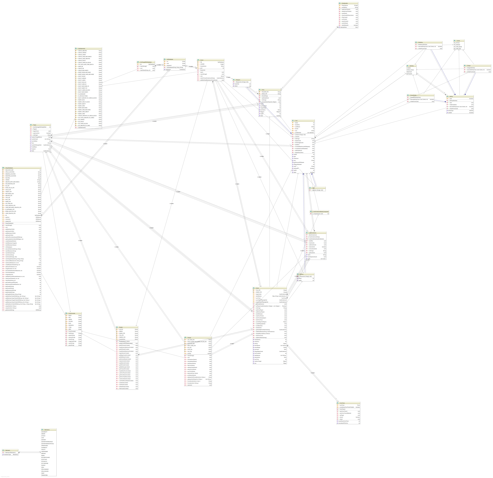

<h1>Howeststone</h1>
<h4>Inleiding</h4>

Wij hebben naar aanleiding van de module Project I  
onze eigen versie gemaakt van het bestaande spel Hearthstone, Howeststone.

<h5>Three Bees and Me (groep 31)</h5>

* Mattijs Step (Oranje) I'm gonna catch them all.
* Bert Van Mulders (Geel) I am one with the force and the force is with me.
* Brend Lambert (Groen) Do what I do, Hold tight and pretend it's a plan!
* Bram Vermeulen (Roze) That's what i do. I drink and I know things.

<h4>Diagrammen</h4>
<h5>Database</h5>

<html>
<head>
<title>Schema for database 'howeststone'</title>
<meta http-equiv="Content-Type" content="text/html; charset=utf8">

</head>
<body bgcolor='#ffffff' topmargin="0">
<table width="100%" border="0" cellspacing="0" cellpadding="5">
<tr>
<td class="toptext">
howeststone</td>
</tr>
</table>
<ul>
	<li><a href="#abilities">
abilities</a></li>
	<li><a href="#cardabilities">
cardabilities</a></li>
	<li><a href="#cardmechanics">
cardmechanics</a></li>
	<li><a href="#cards">
cards</a></li>
	<li><a href="#cardsindecks">
cardsindecks</a></li>
	<li><a href="#decks">
decks</a></li>
	<li><a href="#heroes">
heroes</a></li>
	<li><a href="#mechanics">
mechanics</a></li>
</ul>
 

<table width="100%" border="0" cellspacing="0" cellpadding="3">
<tr>
	<td class="headtext" width="30%" align="left" valign="top">abilities</td>
	<td></td>
<tr>
</table>

<table width="100%" border="0" cellspacing="0" cellpadding="3">
<tr>
	<td class="fieldheader" width="100%" align="left" valign="top">Fields</td>
</tr>
</table>
<table width="100%" cellspacing="0" cellapdding="2" border="1">
<tr>
	<td align="center" valign="top" class="fieldcolumn">Field</td>
	<td align="center" valign="top" class="fieldcolumn">Type</td>
	<td align="center" valign="top" class="fieldcolumn">Collation</td>
	<td align="center" valign="top" class="fieldcolumn">Null</td>
	<td align="center" valign="top" class="fieldcolumn">Key</td>
	<td align="center" valign="top" class="fieldcolumn">Default</td>
	<td align="center" valign="top" class="fieldcolumn">Extra</td>
	<td align="center" valign="top" class="fieldcolumn">Privileges</td>
	<td align="center" valign="top" class="fieldcolumn">Comment</td>
</tr>
<tr>
	<td align="left" valign="top">
abilityId</td>
	<td align="left" valign="top">
int(3)</td>
	<td align="left" valign="top">
(NULL)</td>
	<td align="left" valign="top">
NO</td>
	<td align="left" valign="top">
PRI</td>
	<td align="left" valign="top">
(NULL)</td>
	<td align="left" valign="top">
auto_increment</td>
	<td align="left" valign="top">
select,insert,update,references</td>
	<td align="left" valign="top">
;</td>
</tr>
<tr>
	<td align="left" valign="top">
abilityName</td>
	<td align="left" valign="top">
varchar(45)</td>
	<td align="left" valign="top">
latin1_swedish_ci</td>
	<td align="left" valign="top">
NO</td>
	<td align="left" valign="top">
;</td>
	<td align="left" valign="top">
(NULL)</td>
	<td align="left" valign="top">
;</td>
	<td align="left" valign="top">
select,insert,update,references</td>
	<td align="left" valign="top">
;</td>
</tr>
</table>

<table width="100%" border="0" cellspacing="0" cellpadding="3">
<tr>
	<td class="fieldheader" width="100%" align="left" valign="top">Indexes</td>
</tr>
</table>
<table width="100%" cellspacing="0" cellapdding="2" border="1">
<tr>
	<td align="left" valign="top" class="fieldcolumn">Table</td>
	<td align="left" valign="top" class="fieldcolumn">Non unique</td>
	<td align="left" valign="top" class="fieldcolumn">Key name</td>
	<td align="left" valign="top" class="fieldcolumn">Seq in index</td>
	<td align="left" valign="top" class="fieldcolumn">Column name</td>
	<td align="left" valign="top" class="fieldcolumn">Collation</td>
	<td align="left" valign="top" class="fieldcolumn">Cardinality</td>
	<td align="left" valign="top" class="fieldcolumn">Sub part</td>
	<td align="left" valign="top" class="fieldcolumn">Packed</td>
	<td align="left" valign="top" class="fieldcolumn">Null</td>
	<td align="left" valign="top" class="fieldcolumn">Index type</td>
	<td align="left" valign="top" class="fieldcolumn">Comment</td>
	<td align="left" valign="top" class="fieldcolumn">Index comment</td>
</tr>
<tr>
	<td align="left" valign="top">
abilities</td>
	<td align="left" valign="top">
0</td>
	<td align="left" valign="top">
PRIMARY</td>
	<td align="left" valign="top">
1</td>
	<td align="left" valign="top">
abilityId</td>
	<td align="left" valign="top">
A</td>
	<td align="left" valign="top">
3</td>
	<td align="left" valign="top">
(NULL)</td>
	<td align="left" valign="top">
(NULL)</td>
	<td align="left" valign="top">
;</td>
	<td align="left" valign="top">
BTREE</td>
	<td align="left" valign="top">
;</td>
	<td align="left" valign="top">
;</td>
</tr>
</table>

<a href="#header">
Back</a> 

<table width="100%" border="0" cellspacing="0" cellpadding="3">
<tr>
	<td class="headtext" width="30%" align="left" valign="top">cardabilities</td>
	<td></td>
<tr>
</table>

<table width="100%" border="0" cellspacing="0" cellpadding="3">
<tr>
	<td class="fieldheader" width="100%" align="left" valign="top">Fields</td>
</tr>
</table>
<table width="100%" cellspacing="0" cellapdding="2" border="1">
<tr>
	<td align="center" valign="top" class="fieldcolumn">Field</td>
	<td align="center" valign="top" class="fieldcolumn">Type</td>
	<td align="center" valign="top" class="fieldcolumn">Collation</td>
	<td align="center" valign="top" class="fieldcolumn">Null</td>
	<td align="center" valign="top" class="fieldcolumn">Key</td>
	<td align="center" valign="top" class="fieldcolumn">Default</td>
	<td align="center" valign="top" class="fieldcolumn">Extra</td>
	<td align="center" valign="top" class="fieldcolumn">Privileges</td>
	<td align="center" valign="top" class="fieldcolumn">Comment</td>
</tr>
<tr>
	<td align="left" valign="top">
abilityId</td>
	<td align="left" valign="top">
int(3)</td>
	<td align="left" valign="top">
(NULL)</td>
	<td align="left" valign="top">
NO</td>
	<td align="left" valign="top">
PRI</td>
	<td align="left" valign="top">
(NULL)</td>
	<td align="left" valign="top">
;</td>
	<td align="left" valign="top">
select,insert,update,references</td>
	<td align="left" valign="top">
;</td>
</tr>
<tr>
	<td align="left" valign="top">
cardId</td>
	<td align="left" valign="top">
int(3)</td>
	<td align="left" valign="top">
(NULL)</td>
	<td align="left" valign="top">
NO</td>
	<td align="left" valign="top">
PRI</td>
	<td align="left" valign="top">
(NULL)</td>
	<td align="left" valign="top">
;</td>
	<td align="left" valign="top">
select,insert,update,references</td>
	<td align="left" valign="top">
;</td>
</tr>
<tr>
	<td align="left" valign="top">
cardMechId</td>
	<td align="left" valign="top">
int(3)</td>
	<td align="left" valign="top">
(NULL)</td>
	<td align="left" valign="top">
NO</td>
	<td align="left" valign="top">
PRI</td>
	<td align="left" valign="top">
(NULL)</td>
	<td align="left" valign="top">
;</td>
	<td align="left" valign="top">
select,insert,update,references</td>
	<td align="left" valign="top">
;</td>
</tr>
</table>

<table width="100%" border="0" cellspacing="0" cellpadding="3">
<tr>
	<td class="fieldheader" width="100%" align="left" valign="top">Indexes</td>
</tr>
</table>
<table width="100%" cellspacing="0" cellapdding="2" border="1">
<tr>
	<td align="left" valign="top" class="fieldcolumn">Table</td>
	<td align="left" valign="top" class="fieldcolumn">Non unique</td>
	<td align="left" valign="top" class="fieldcolumn">Key name</td>
	<td align="left" valign="top" class="fieldcolumn">Seq in index</td>
	<td align="left" valign="top" class="fieldcolumn">Column name</td>
	<td align="left" valign="top" class="fieldcolumn">Collation</td>
	<td align="left" valign="top" class="fieldcolumn">Cardinality</td>
	<td align="left" valign="top" class="fieldcolumn">Sub part</td>
	<td align="left" valign="top" class="fieldcolumn">Packed</td>
	<td align="left" valign="top" class="fieldcolumn">Null</td>
	<td align="left" valign="top" class="fieldcolumn">Index type</td>
	<td align="left" valign="top" class="fieldcolumn">Comment</td>
	<td align="left" valign="top" class="fieldcolumn">Index comment</td>
</tr>
<tr>
	<td align="left" valign="top">
cardabilities</td>
	<td align="left" valign="top">
0</td>
	<td align="left" valign="top">
PRIMARY</td>
	<td align="left" valign="top">
1</td>
	<td align="left" valign="top">
abilityId</td>
	<td align="left" valign="top">
A</td>
	<td align="left" valign="top">
30</td>
	<td align="left" valign="top">
(NULL)</td>
	<td align="left" valign="top">
(NULL)</td>
	<td align="left" valign="top">
;</td>
	<td align="left" valign="top">
BTREE</td>
	<td align="left" valign="top">
;</td>
	<td align="left" valign="top">
;</td>
</tr>
<tr>
	<td align="left" valign="top">
cardabilities</td>
	<td align="left" valign="top">
0</td>
	<td align="left" valign="top">
PRIMARY</td>
	<td align="left" valign="top">
2</td>
	<td align="left" valign="top">
cardId</td>
	<td align="left" valign="top">
A</td>
	<td align="left" valign="top">
117</td>
	<td align="left" valign="top">
(NULL)</td>
	<td align="left" valign="top">
(NULL)</td>
	<td align="left" valign="top">
;</td>
	<td align="left" valign="top">
BTREE</td>
	<td align="left" valign="top">
;</td>
	<td align="left" valign="top">
;</td>
</tr>
<tr>
	<td align="left" valign="top">
cardabilities</td>
	<td align="left" valign="top">
0</td>
	<td align="left" valign="top">
PRIMARY</td>
	<td align="left" valign="top">
3</td>
	<td align="left" valign="top">
cardMechId</td>
	<td align="left" valign="top">
A</td>
	<td align="left" valign="top">
158</td>
	<td align="left" valign="top">
(NULL)</td>
	<td align="left" valign="top">
(NULL)</td>
	<td align="left" valign="top">
;</td>
	<td align="left" valign="top">
BTREE</td>
	<td align="left" valign="top">
;</td>
	<td align="left" valign="top">
;</td>
</tr>
<tr>
	<td align="left" valign="top">
cardabilities</td>
	<td align="left" valign="top">
1</td>
	<td align="left" valign="top">
fk_CardAbilities2</td>
	<td align="left" valign="top">
1</td>
	<td align="left" valign="top">
cardId</td>
	<td align="left" valign="top">
A</td>
	<td align="left" valign="top">
105</td>
	<td align="left" valign="top">
(NULL)</td>
	<td align="left" valign="top">
(NULL)</td>
	<td align="left" valign="top">
;</td>
	<td align="left" valign="top">
BTREE</td>
	<td align="left" valign="top">
;</td>
	<td align="left" valign="top">
;</td>
</tr>
<tr>
	<td align="left" valign="top">
cardabilities</td>
	<td align="left" valign="top">
1</td>
	<td align="left" valign="top">
fk_CardAbilities3</td>
	<td align="left" valign="top">
1</td>
	<td align="left" valign="top">
cardMechId</td>
	<td align="left" valign="top">
A</td>
	<td align="left" valign="top">
132</td>
	<td align="left" valign="top">
(NULL)</td>
	<td align="left" valign="top">
(NULL)</td>
	<td align="left" valign="top">
;</td>
	<td align="left" valign="top">
BTREE</td>
	<td align="left" valign="top">
;</td>
	<td align="left" valign="top">
;</td>
</tr>
</table>

<table width="100%" border="0" cellspacing="0" cellpadding="3">
<tr>
	<td class="fieldheader" width="100%" align="left" valign="top">Foreign Key Relationships</td>
</tr>
</table>
<table width="100%" cellspacing="0" cellapdding="2" border="1">
<tr>
	<td align="left" valign="top" class="fieldcolumn">FK Id</td>
	<td align="left" valign="top" class="fieldcolumn">Reference Table</td>
	<td align="left" valign="top" class="fieldcolumn">Source Column</td>
	<td align="left" valign="top" class="fieldcolumn">Target Column</td>
	<td align="left" valign="top" class="fieldcolumn">Extra Info</td>
</tr>
<tr>
	<td align="left" valign="top">
fk_CardAbilities</td>
	<td align="left" valign="top">
abilities</td>
	<td align="left" valign="top">
`abilityId`</td>
	<td align="left" valign="top">
`abilityId`</td>
	<td align="left" valign="top">
,</td>
<tr>
<tr>
	<td align="left" valign="top">
fk_CardAbilities2</td>
	<td align="left" valign="top">
cards</td>
	<td align="left" valign="top">
`cardId`</td>
	<td align="left" valign="top">
`cardId`</td>
	<td align="left" valign="top">
,</td>
<tr>
<tr>
	<td align="left" valign="top">
fk_CardAbilities3</td>
	<td align="left" valign="top">
cardmechanics</td>
	<td align="left" valign="top">
`cardMechId`</td>
	<td align="left" valign="top">
`cardMechId`</td>
<tr>
</table>

<a href="#header">
Back</a> 

<table width="100%" border="0" cellspacing="0" cellpadding="3">
<tr>
	<td class="headtext" width="30%" align="left" valign="top">cardmechanics</td>
	<td></td>
<tr>
</table>

<table width="100%" border="0" cellspacing="0" cellpadding="3">
<tr>
	<td class="fieldheader" width="100%" align="left" valign="top">Fields</td>
</tr>
</table>
<table width="100%" cellspacing="0" cellapdding="2" border="1">
<tr>
	<td align="center" valign="top" class="fieldcolumn">Field</td>
	<td align="center" valign="top" class="fieldcolumn">Type</td>
	<td align="center" valign="top" class="fieldcolumn">Collation</td>
	<td align="center" valign="top" class="fieldcolumn">Null</td>
	<td align="center" valign="top" class="fieldcolumn">Key</td>
	<td align="center" valign="top" class="fieldcolumn">Default</td>
	<td align="center" valign="top" class="fieldcolumn">Extra</td>
	<td align="center" valign="top" class="fieldcolumn">Privileges</td>
	<td align="center" valign="top" class="fieldcolumn">Comment</td>
</tr>
<tr>
	<td align="left" valign="top">
cardMechId</td>
	<td align="left" valign="top">
int(3)</td>
	<td align="left" valign="top">
(NULL)</td>
	<td align="left" valign="top">
NO</td>
	<td align="left" valign="top">
PRI</td>
	<td align="left" valign="top">
(NULL)</td>
	<td align="left" valign="top">
auto_increment</td>
	<td align="left" valign="top">
select,insert,update,references</td>
	<td align="left" valign="top">
;</td>
</tr>
<tr>
	<td align="left" valign="top">
mechanicId</td>
	<td align="left" valign="top">
int(3)</td>
	<td align="left" valign="top">
(NULL)</td>
	<td align="left" valign="top">
NO</td>
	<td align="left" valign="top">
MUL</td>
	<td align="left" valign="top">
(NULL)</td>
	<td align="left" valign="top">
;</td>
	<td align="left" valign="top">
select,insert,update,references</td>
	<td align="left" valign="top">
;</td>
</tr>
<tr>
	<td align="left" valign="top">
target</td>
	<td align="left" valign="top">
varchar(45)</td>
	<td align="left" valign="top">
latin1_swedish_ci</td>
	<td align="left" valign="top">
YES</td>
	<td align="left" valign="top">
;</td>
	<td align="left" valign="top">
(NULL)</td>
	<td align="left" valign="top">
;</td>
	<td align="left" valign="top">
select,insert,update,references</td>
	<td align="left" valign="top">
;</td>
</tr>
<tr>
	<td align="left" valign="top">
mechValue</td>
	<td align="left" valign="top">
varchar(45)</td>
	<td align="left" valign="top">
latin1_swedish_ci</td>
	<td align="left" valign="top">
YES</td>
	<td align="left" valign="top">
;</td>
	<td align="left" valign="top">
(NULL)</td>
	<td align="left" valign="top">
;</td>
	<td align="left" valign="top">
select,insert,update,references</td>
	<td align="left" valign="top">
;</td>
</tr>
</table>

<table width="100%" border="0" cellspacing="0" cellpadding="3">
<tr>
	<td class="fieldheader" width="100%" align="left" valign="top">Indexes</td>
</tr>
</table>
<table width="100%" cellspacing="0" cellapdding="2" border="1">
<tr>
	<td align="left" valign="top" class="fieldcolumn">Table</td>
	<td align="left" valign="top" class="fieldcolumn">Non unique</td>
	<td align="left" valign="top" class="fieldcolumn">Key name</td>
	<td align="left" valign="top" class="fieldcolumn">Seq in index</td>
	<td align="left" valign="top" class="fieldcolumn">Column name</td>
	<td align="left" valign="top" class="fieldcolumn">Collation</td>
	<td align="left" valign="top" class="fieldcolumn">Cardinality</td>
	<td align="left" valign="top" class="fieldcolumn">Sub part</td>
	<td align="left" valign="top" class="fieldcolumn">Packed</td>
	<td align="left" valign="top" class="fieldcolumn">Null</td>
	<td align="left" valign="top" class="fieldcolumn">Index type</td>
	<td align="left" valign="top" class="fieldcolumn">Comment</td>
	<td align="left" valign="top" class="fieldcolumn">Index comment</td>
</tr>
<tr>
	<td align="left" valign="top">
cardmechanics</td>
	<td align="left" valign="top">
0</td>
	<td align="left" valign="top">
PRIMARY</td>
	<td align="left" valign="top">
1</td>
	<td align="left" valign="top">
cardMechId</td>
	<td align="left" valign="top">
A</td>
	<td align="left" valign="top">
118</td>
	<td align="left" valign="top">
(NULL)</td>
	<td align="left" valign="top">
(NULL)</td>
	<td align="left" valign="top">
;</td>
	<td align="left" valign="top">
BTREE</td>
	<td align="left" valign="top">
;</td>
	<td align="left" valign="top">
;</td>
</tr>
<tr>
	<td align="left" valign="top">
cardmechanics</td>
	<td align="left" valign="top">
1</td>
	<td align="left" valign="top">
fk_cardMechanics</td>
	<td align="left" valign="top">
1</td>
	<td align="left" valign="top">
mechanicId</td>
	<td align="left" valign="top">
A</td>
	<td align="left" valign="top">
24</td>
	<td align="left" valign="top">
(NULL)</td>
	<td align="left" valign="top">
(NULL)</td>
	<td align="left" valign="top">
;</td>
	<td align="left" valign="top">
BTREE</td>
	<td align="left" valign="top">
;</td>
	<td align="left" valign="top">
;</td>
</tr>
</table>

<table width="100%" border="0" cellspacing="0" cellpadding="3">
<tr>
	<td class="fieldheader" width="100%" align="left" valign="top">Foreign Key Relationships</td>
</tr>
</table>
<table width="100%" cellspacing="0" cellapdding="2" border="1">
<tr>
	<td align="left" valign="top" class="fieldcolumn">FK Id</td>
	<td align="left" valign="top" class="fieldcolumn">Reference Table</td>
	<td align="left" valign="top" class="fieldcolumn">Source Column</td>
	<td align="left" valign="top" class="fieldcolumn">Target Column</td>
	<td align="left" valign="top" class="fieldcolumn">Extra Info</td>
</tr>
<tr>
	<td align="left" valign="top">
fk_cardMechanics</td>
	<td align="left" valign="top">
mechanics</td>
	<td align="left" valign="top">
`mechanicId`</td>
	<td align="left" valign="top">
`mechanicId`</td>
<tr>
</table>

<a href="#header">
Back</a> 

<table width="100%" border="0" cellspacing="0" cellpadding="3">
<tr>
	<td class="headtext" width="30%" align="left" valign="top">cards</td>
	<td></td>
<tr>
</table>

<table width="100%" border="0" cellspacing="0" cellpadding="3">
<tr>
	<td class="fieldheader" width="100%" align="left" valign="top">Fields</td>
</tr>
</table>
<table width="100%" cellspacing="0" cellapdding="2" border="1">
<tr>
	<td align="center" valign="top" class="fieldcolumn">Field</td>
	<td align="center" valign="top" class="fieldcolumn">Type</td>
	<td align="center" valign="top" class="fieldcolumn">Collation</td>
	<td align="center" valign="top" class="fieldcolumn">Null</td>
	<td align="center" valign="top" class="fieldcolumn">Key</td>
	<td align="center" valign="top" class="fieldcolumn">Default</td>
	<td align="center" valign="top" class="fieldcolumn">Extra</td>
	<td align="center" valign="top" class="fieldcolumn">Privileges</td>
	<td align="center" valign="top" class="fieldcolumn">Comment</td>
</tr>
<tr>
	<td align="left" valign="top">
cardId</td>
	<td align="left" valign="top">
int(3)</td>
	<td align="left" valign="top">
(NULL)</td>
	<td align="left" valign="top">
NO</td>
	<td align="left" valign="top">
PRI</td>
	<td align="left" valign="top">
(NULL)</td>
	<td align="left" valign="top">
auto_increment</td>
	<td align="left" valign="top">
select,insert,update,references</td>
	<td align="left" valign="top">
;</td>
</tr>
<tr>
	<td align="left" valign="top">
cardName</td>
	<td align="left" valign="top">
varchar(45)</td>
	<td align="left" valign="top">
latin1_swedish_ci</td>
	<td align="left" valign="top">
NO</td>
	<td align="left" valign="top">
;</td>
	<td align="left" valign="top">
(NULL)</td>
	<td align="left" valign="top">
;</td>
	<td align="left" valign="top">
select,insert,update,references</td>
	<td align="left" valign="top">
;</td>
</tr>
<tr>
	<td align="left" valign="top">
cardType</td>
	<td align="left" valign="top">
varchar(45)</td>
	<td align="left" valign="top">
latin1_swedish_ci</td>
	<td align="left" valign="top">
NO</td>
	<td align="left" valign="top">
;</td>
	<td align="left" valign="top">
(NULL)</td>
	<td align="left" valign="top">
;</td>
	<td align="left" valign="top">
select,insert,update,references</td>
	<td align="left" valign="top">
;</td>
</tr>
<tr>
	<td align="left" valign="top">
race</td>
	<td align="left" valign="top">
varchar(45)</td>
	<td align="left" valign="top">
latin1_swedish_ci</td>
	<td align="left" valign="top">
YES</td>
	<td align="left" valign="top">
;</td>
	<td align="left" valign="top">
(NULL)</td>
	<td align="left" valign="top">
;</td>
	<td align="left" valign="top">
select,insert,update,references</td>
	<td align="left" valign="top">
;</td>
</tr>
<tr>
	<td align="left" valign="top">
img</td>
	<td align="left" valign="top">
varchar(100)</td>
	<td align="left" valign="top">
latin1_swedish_ci</td>
	<td align="left" valign="top">
NO</td>
	<td align="left" valign="top">
;</td>
	<td align="left" valign="top">
(NULL)</td>
	<td align="left" valign="top">
;</td>
	<td align="left" valign="top">
select,insert,update,references</td>
	<td align="left" valign="top">
;</td>
</tr>
<tr>
	<td align="left" valign="top">
rarity</td>
	<td align="left" valign="top">
varchar(45)</td>
	<td align="left" valign="top">
latin1_swedish_ci</td>
	<td align="left" valign="top">
NO</td>
	<td align="left" valign="top">
;</td>
	<td align="left" valign="top">
(NULL)</td>
	<td align="left" valign="top">
;</td>
	<td align="left" valign="top">
select,insert,update,references</td>
	<td align="left" valign="top">
;</td>
</tr>
<tr>
	<td align="left" valign="top">
health</td>
	<td align="left" valign="top">
int(2)</td>
	<td align="left" valign="top">
(NULL)</td>
	<td align="left" valign="top">
YES</td>
	<td align="left" valign="top">
;</td>
	<td align="left" valign="top">
(NULL)</td>
	<td align="left" valign="top">
;</td>
	<td align="left" valign="top">
select,insert,update,references</td>
	<td align="left" valign="top">
;</td>
</tr>
<tr>
	<td align="left" valign="top">
attack</td>
	<td align="left" valign="top">
int(2)</td>
	<td align="left" valign="top">
(NULL)</td>
	<td align="left" valign="top">
YES</td>
	<td align="left" valign="top">
;</td>
	<td align="left" valign="top">
(NULL)</td>
	<td align="left" valign="top">
;</td>
	<td align="left" valign="top">
select,insert,update,references</td>
	<td align="left" valign="top">
;</td>
</tr>
<tr>
	<td align="left" valign="top">
manaCost</td>
	<td align="left" valign="top">
int(2)</td>
	<td align="left" valign="top">
(NULL)</td>
	<td align="left" valign="top">
NO</td>
	<td align="left" valign="top">
;</td>
	<td align="left" valign="top">
(NULL)</td>
	<td align="left" valign="top">
;</td>
	<td align="left" valign="top">
select,insert,update,references</td>
	<td align="left" valign="top">
;</td>
</tr>
<tr>
	<td align="left" valign="top">
durability</td>
	<td align="left" valign="top">
int(2)</td>
	<td align="left" valign="top">
(NULL)</td>
	<td align="left" valign="top">
YES</td>
	<td align="left" valign="top">
;</td>
	<td align="left" valign="top">
(NULL)</td>
	<td align="left" valign="top">
;</td>
	<td align="left" valign="top">
select,insert,update,references</td>
	<td align="left" valign="top">
;</td>
</tr>
<tr>
	<td align="left" valign="top">
heroId</td>
	<td align="left" valign="top">
int(2)</td>
	<td align="left" valign="top">
(NULL)</td>
	<td align="left" valign="top">
YES</td>
	<td align="left" valign="top">
MUL</td>
	<td align="left" valign="top">
(NULL)</td>
	<td align="left" valign="top">
;</td>
	<td align="left" valign="top">
select,insert,update,references</td>
	<td align="left" valign="top">
;</td>
</tr>
</table>

<table width="100%" border="0" cellspacing="0" cellpadding="3">
<tr>
	<td class="fieldheader" width="100%" align="left" valign="top">Indexes</td>
</tr>
</table>
<table width="100%" cellspacing="0" cellapdding="2" border="1">
<tr>
	<td align="left" valign="top" class="fieldcolumn">Table</td>
	<td align="left" valign="top" class="fieldcolumn">Non unique</td>
	<td align="left" valign="top" class="fieldcolumn">Key name</td>
	<td align="left" valign="top" class="fieldcolumn">Seq in index</td>
	<td align="left" valign="top" class="fieldcolumn">Column name</td>
	<td align="left" valign="top" class="fieldcolumn">Collation</td>
	<td align="left" valign="top" class="fieldcolumn">Cardinality</td>
	<td align="left" valign="top" class="fieldcolumn">Sub part</td>
	<td align="left" valign="top" class="fieldcolumn">Packed</td>
	<td align="left" valign="top" class="fieldcolumn">Null</td>
	<td align="left" valign="top" class="fieldcolumn">Index type</td>
	<td align="left" valign="top" class="fieldcolumn">Comment</td>
	<td align="left" valign="top" class="fieldcolumn">Index comment</td>
</tr>
<tr>
	<td align="left" valign="top">
cards</td>
	<td align="left" valign="top">
0</td>
	<td align="left" valign="top">
PRIMARY</td>
	<td align="left" valign="top">
1</td>
	<td align="left" valign="top">
cardId</td>
	<td align="left" valign="top">
A</td>
	<td align="left" valign="top">
2</td>
	<td align="left" valign="top">
(NULL)</td>
	<td align="left" valign="top">
(NULL)</td>
	<td align="left" valign="top">
;</td>
	<td align="left" valign="top">
BTREE</td>
	<td align="left" valign="top">
;</td>
	<td align="left" valign="top">
;</td>
</tr>
<tr>
	<td align="left" valign="top">
cards</td>
	<td align="left" valign="top">
1</td>
	<td align="left" valign="top">
fk_cards</td>
	<td align="left" valign="top">
1</td>
	<td align="left" valign="top">
heroId</td>
	<td align="left" valign="top">
A</td>
	<td align="left" valign="top">
2</td>
	<td align="left" valign="top">
(NULL)</td>
	<td align="left" valign="top">
(NULL)</td>
	<td align="left" valign="top">
YES</td>
	<td align="left" valign="top">
BTREE</td>
	<td align="left" valign="top">
;</td>
	<td align="left" valign="top">
;</td>
</tr>
</table>

<table width="100%" border="0" cellspacing="0" cellpadding="3">
<tr>
	<td class="fieldheader" width="100%" align="left" valign="top">Foreign Key Relationships</td>
</tr>
</table>
<table width="100%" cellspacing="0" cellapdding="2" border="1">
<tr>
	<td align="left" valign="top" class="fieldcolumn">FK Id</td>
	<td align="left" valign="top" class="fieldcolumn">Reference Table</td>
	<td align="left" valign="top" class="fieldcolumn">Source Column</td>
	<td align="left" valign="top" class="fieldcolumn">Target Column</td>
	<td align="left" valign="top" class="fieldcolumn">Extra Info</td>
</tr>
<tr>
	<td align="left" valign="top">
fk_cards</td>
	<td align="left" valign="top">
heroes</td>
	<td align="left" valign="top">
`heroId`</td>
	<td align="left" valign="top">
`heroId`</td>
<tr>
</table>

<a href="#header">
Back</a> 

<table width="100%" border="0" cellspacing="0" cellpadding="3">
<tr>
	<td class="headtext" width="30%" align="left" valign="top">cardsindecks</td>
	<td></td>
<tr>
</table>

<table width="100%" border="0" cellspacing="0" cellpadding="3">
<tr>
	<td class="fieldheader" width="100%" align="left" valign="top">Fields</td>
</tr>
</table>
<table width="100%" cellspacing="0" cellapdding="2" border="1">
<tr>
	<td align="center" valign="top" class="fieldcolumn">Field</td>
	<td align="center" valign="top" class="fieldcolumn">Type</td>
	<td align="center" valign="top" class="fieldcolumn">Collation</td>
	<td align="center" valign="top" class="fieldcolumn">Null</td>
	<td align="center" valign="top" class="fieldcolumn">Key</td>
	<td align="center" valign="top" class="fieldcolumn">Default</td>
	<td align="center" valign="top" class="fieldcolumn">Extra</td>
	<td align="center" valign="top" class="fieldcolumn">Privileges</td>
	<td align="center" valign="top" class="fieldcolumn">Comment</td>
</tr>
<tr>
	<td align="left" valign="top">
deckId</td>
	<td align="left" valign="top">
int(2)</td>
	<td align="left" valign="top">
(NULL)</td>
	<td align="left" valign="top">
NO</td>
	<td align="left" valign="top">
PRI</td>
	<td align="left" valign="top">
(NULL)</td>
	<td align="left" valign="top">
;</td>
	<td align="left" valign="top">
select,insert,update,references</td>
	<td align="left" valign="top">
;</td>
</tr>
<tr>
	<td align="left" valign="top">
cardId</td>
	<td align="left" valign="top">
int(3)</td>
	<td align="left" valign="top">
(NULL)</td>
	<td align="left" valign="top">
NO</td>
	<td align="left" valign="top">
PRI</td>
	<td align="left" valign="top">
(NULL)</td>
	<td align="left" valign="top">
;</td>
	<td align="left" valign="top">
select,insert,update,references</td>
	<td align="left" valign="top">
;</td>
</tr>
<tr>
	<td align="left" valign="top">
amount</td>
	<td align="left" valign="top">
int(1)</td>
	<td align="left" valign="top">
(NULL)</td>
	<td align="left" valign="top">
NO</td>
	<td align="left" valign="top">
;</td>
	<td align="left" valign="top">
(NULL)</td>
	<td align="left" valign="top">
;</td>
	<td align="left" valign="top">
select,insert,update,references</td>
	<td align="left" valign="top">
;</td>
</tr>
</table>

<table width="100%" border="0" cellspacing="0" cellpadding="3">
<tr>
	<td class="fieldheader" width="100%" align="left" valign="top">Indexes</td>
</tr>
</table>
<table width="100%" cellspacing="0" cellapdding="2" border="1">
<tr>
	<td align="left" valign="top" class="fieldcolumn">Table</td>
	<td align="left" valign="top" class="fieldcolumn">Non unique</td>
	<td align="left" valign="top" class="fieldcolumn">Key name</td>
	<td align="left" valign="top" class="fieldcolumn">Seq in index</td>
	<td align="left" valign="top" class="fieldcolumn">Column name</td>
	<td align="left" valign="top" class="fieldcolumn">Collation</td>
	<td align="left" valign="top" class="fieldcolumn">Cardinality</td>
	<td align="left" valign="top" class="fieldcolumn">Sub part</td>
	<td align="left" valign="top" class="fieldcolumn">Packed</td>
	<td align="left" valign="top" class="fieldcolumn">Null</td>
	<td align="left" valign="top" class="fieldcolumn">Index type</td>
	<td align="left" valign="top" class="fieldcolumn">Comment</td>
	<td align="left" valign="top" class="fieldcolumn">Index comment</td>
</tr>
<tr>
	<td align="left" valign="top">
cardsindecks</td>
	<td align="left" valign="top">
0</td>
	<td align="left" valign="top">
PRIMARY</td>
	<td align="left" valign="top">
1</td>
	<td align="left" valign="top">
deckId</td>
	<td align="left" valign="top">
A</td>
	<td align="left" valign="top">
6</td>
	<td align="left" valign="top">
(NULL)</td>
	<td align="left" valign="top">
(NULL)</td>
	<td align="left" valign="top">
;</td>
	<td align="left" valign="top">
BTREE</td>
	<td align="left" valign="top">
;</td>
	<td align="left" valign="top">
;</td>
</tr>
<tr>
	<td align="left" valign="top">
cardsindecks</td>
	<td align="left" valign="top">
0</td>
	<td align="left" valign="top">
PRIMARY</td>
	<td align="left" valign="top">
2</td>
	<td align="left" valign="top">
cardId</td>
	<td align="left" valign="top">
A</td>
	<td align="left" valign="top">
6</td>
	<td align="left" valign="top">
(NULL)</td>
	<td align="left" valign="top">
(NULL)</td>
	<td align="left" valign="top">
;</td>
	<td align="left" valign="top">
BTREE</td>
	<td align="left" valign="top">
;</td>
	<td align="left" valign="top">
;</td>
</tr>
<tr>
	<td align="left" valign="top">
cardsindecks</td>
	<td align="left" valign="top">
1</td>
	<td align="left" valign="top">
fk_CardsInDecks2</td>
	<td align="left" valign="top">
1</td>
	<td align="left" valign="top">
cardId</td>
	<td align="left" valign="top">
A</td>
	<td align="left" valign="top">
6</td>
	<td align="left" valign="top">
(NULL)</td>
	<td align="left" valign="top">
(NULL)</td>
	<td align="left" valign="top">
;</td>
	<td align="left" valign="top">
BTREE</td>
	<td align="left" valign="top">
;</td>
	<td align="left" valign="top">
;</td>
</tr>
</table>

<table width="100%" border="0" cellspacing="0" cellpadding="3">
<tr>
	<td class="fieldheader" width="100%" align="left" valign="top">Foreign Key Relationships</td>
</tr>
</table>
<table width="100%" cellspacing="0" cellapdding="2" border="1">
<tr>
	<td align="left" valign="top" class="fieldcolumn">FK Id</td>
	<td align="left" valign="top" class="fieldcolumn">Reference Table</td>
	<td align="left" valign="top" class="fieldcolumn">Source Column</td>
	<td align="left" valign="top" class="fieldcolumn">Target Column</td>
	<td align="left" valign="top" class="fieldcolumn">Extra Info</td>
</tr>
<tr>
	<td align="left" valign="top">
fk_CardsInDecks</td>
	<td align="left" valign="top">
decks</td>
	<td align="left" valign="top">
`deckId`</td>
	<td align="left" valign="top">
`deckId`</td>
	<td align="left" valign="top">
,</td>
<tr>
<tr>
	<td align="left" valign="top">
fk_CardsInDecks2</td>
	<td align="left" valign="top">
cards</td>
	<td align="left" valign="top">
`cardId`</td>
	<td align="left" valign="top">
`cardId`</td>
<tr>
</table>

<a href="#header">
Back</a> 

<table width="100%" border="0" cellspacing="0" cellpadding="3">
<tr>
	<td class="headtext" width="30%" align="left" valign="top">decks</td>
	<td></td>
<tr>
</table>

<table width="100%" border="0" cellspacing="0" cellpadding="3">
<tr>
	<td class="fieldheader" width="100%" align="left" valign="top">Fields</td>
</tr>
</table>
<table width="100%" cellspacing="0" cellapdding="2" border="1">
<tr>
	<td align="center" valign="top" class="fieldcolumn">Field</td>
	<td align="center" valign="top" class="fieldcolumn">Type</td>
	<td align="center" valign="top" class="fieldcolumn">Collation</td>
	<td align="center" valign="top" class="fieldcolumn">Null</td>
	<td align="center" valign="top" class="fieldcolumn">Key</td>
	<td align="center" valign="top" class="fieldcolumn">Default</td>
	<td align="center" valign="top" class="fieldcolumn">Extra</td>
	<td align="center" valign="top" class="fieldcolumn">Privileges</td>
	<td align="center" valign="top" class="fieldcolumn">Comment</td>
</tr>
<tr>
	<td align="left" valign="top">
deckId</td>
	<td align="left" valign="top">
int(2)</td>
	<td align="left" valign="top">
(NULL)</td>
	<td align="left" valign="top">
NO</td>
	<td align="left" valign="top">
PRI</td>
	<td align="left" valign="top">
(NULL)</td>
	<td align="left" valign="top">
auto_increment</td>
	<td align="left" valign="top">
select,insert,update,references</td>
	<td align="left" valign="top">
;</td>
</tr>
<tr>
	<td align="left" valign="top">
deckName</td>
	<td align="left" valign="top">
varchar(45)</td>
	<td align="left" valign="top">
latin1_swedish_ci</td>
	<td align="left" valign="top">
NO</td>
	<td align="left" valign="top">
;</td>
	<td align="left" valign="top">
(NULL)</td>
	<td align="left" valign="top">
;</td>
	<td align="left" valign="top">
select,insert,update,references</td>
	<td align="left" valign="top">
;</td>
</tr>
<tr>
	<td align="left" valign="top">
heroId</td>
	<td align="left" valign="top">
int(2)</td>
	<td align="left" valign="top">
(NULL)</td>
	<td align="left" valign="top">
NO</td>
	<td align="left" valign="top">
MUL</td>
	<td align="left" valign="top">
(NULL)</td>
	<td align="left" valign="top">
;</td>
	<td align="left" valign="top">
select,insert,update,references</td>
	<td align="left" valign="top">
;</td>
</tr>
</table>

<table width="100%" border="0" cellspacing="0" cellpadding="3">
<tr>
	<td class="fieldheader" width="100%" align="left" valign="top">Indexes</td>
</tr>
</table>
<table width="100%" cellspacing="0" cellapdding="2" border="1">
<tr>
	<td align="left" valign="top" class="fieldcolumn">Table</td>
	<td align="left" valign="top" class="fieldcolumn">Non unique</td>
	<td align="left" valign="top" class="fieldcolumn">Key name</td>
	<td align="left" valign="top" class="fieldcolumn">Seq in index</td>
	<td align="left" valign="top" class="fieldcolumn">Column name</td>
	<td align="left" valign="top" class="fieldcolumn">Collation</td>
	<td align="left" valign="top" class="fieldcolumn">Cardinality</td>
	<td align="left" valign="top" class="fieldcolumn">Sub part</td>
	<td align="left" valign="top" class="fieldcolumn">Packed</td>
	<td align="left" valign="top" class="fieldcolumn">Null</td>
	<td align="left" valign="top" class="fieldcolumn">Index type</td>
	<td align="left" valign="top" class="fieldcolumn">Comment</td>
	<td align="left" valign="top" class="fieldcolumn">Index comment</td>
</tr>
<tr>
	<td align="left" valign="top">
decks</td>
	<td align="left" valign="top">
0</td>
	<td align="left" valign="top">
PRIMARY</td>
	<td align="left" valign="top">
1</td>
	<td align="left" valign="top">
deckId</td>
	<td align="left" valign="top">
A</td>
	<td align="left" valign="top">
2</td>
	<td align="left" valign="top">
(NULL)</td>
	<td align="left" valign="top">
(NULL)</td>
	<td align="left" valign="top">
;</td>
	<td align="left" valign="top">
BTREE</td>
	<td align="left" valign="top">
;</td>
	<td align="left" valign="top">
;</td>
</tr>
<tr>
	<td align="left" valign="top">
decks</td>
	<td align="left" valign="top">
1</td>
	<td align="left" valign="top">
fk_Decks</td>
	<td align="left" valign="top">
1</td>
	<td align="left" valign="top">
heroId</td>
	<td align="left" valign="top">
A</td>
	<td align="left" valign="top">
2</td>
	<td align="left" valign="top">
(NULL)</td>
	<td align="left" valign="top">
(NULL)</td>
	<td align="left" valign="top">
;</td>
	<td align="left" valign="top">
BTREE</td>
	<td align="left" valign="top">
;</td>
	<td align="left" valign="top">
;</td>
</tr>
</table>

<table width="100%" border="0" cellspacing="0" cellpadding="3">
<tr>
	<td class="fieldheader" width="100%" align="left" valign="top">Foreign Key Relationships</td>
</tr>
</table>
<table width="100%" cellspacing="0" cellapdding="2" border="1">
<tr>
	<td align="left" valign="top" class="fieldcolumn">FK Id</td>
	<td align="left" valign="top" class="fieldcolumn">Reference Table</td>
	<td align="left" valign="top" class="fieldcolumn">Source Column</td>
	<td align="left" valign="top" class="fieldcolumn">Target Column</td>
	<td align="left" valign="top" class="fieldcolumn">Extra Info</td>
</tr>
<tr>
	<td align="left" valign="top">
fk_Decks</td>
	<td align="left" valign="top">
heroes</td>
	<td align="left" valign="top">
`heroId`</td>
	<td align="left" valign="top">
`heroId`</td>
<tr>
</table>

<a href="#header">
Back</a> 

<table width="100%" border="0" cellspacing="0" cellpadding="3">
<tr>
	<td class="headtext" width="30%" align="left" valign="top">heroes</td>
	<td></td>
<tr>
</table>

<table width="100%" border="0" cellspacing="0" cellpadding="3">
<tr>
	<td class="fieldheader" width="100%" align="left" valign="top">Fields</td>
</tr>
</table>
<table width="100%" cellspacing="0" cellapdding="2" border="1">
<tr>
	<td align="center" valign="top" class="fieldcolumn">Field</td>
	<td align="center" valign="top" class="fieldcolumn">Type</td>
	<td align="center" valign="top" class="fieldcolumn">Collation</td>
	<td align="center" valign="top" class="fieldcolumn">Null</td>
	<td align="center" valign="top" class="fieldcolumn">Key</td>
	<td align="center" valign="top" class="fieldcolumn">Default</td>
	<td align="center" valign="top" class="fieldcolumn">Extra</td>
	<td align="center" valign="top" class="fieldcolumn">Privileges</td>
	<td align="center" valign="top" class="fieldcolumn">Comment</td>
</tr>
<tr>
	<td align="left" valign="top">
heroId</td>
	<td align="left" valign="top">
int(2)</td>
	<td align="left" valign="top">
(NULL)</td>
	<td align="left" valign="top">
NO</td>
	<td align="left" valign="top">
PRI</td>
	<td align="left" valign="top">
(NULL)</td>
	<td align="left" valign="top">
auto_increment</td>
	<td align="left" valign="top">
select,insert,update,references</td>
	<td align="left" valign="top">
;</td>
</tr>
<tr>
	<td align="left" valign="top">
heroName</td>
	<td align="left" valign="top">
varchar(45)</td>
	<td align="left" valign="top">
latin1_swedish_ci</td>
	<td align="left" valign="top">
NO</td>
	<td align="left" valign="top">
;</td>
	<td align="left" valign="top">
(NULL)</td>
	<td align="left" valign="top">
;</td>
	<td align="left" valign="top">
select,insert,update,references</td>
	<td align="left" valign="top">
;</td>
</tr>
</table>

<table width="100%" border="0" cellspacing="0" cellpadding="3">
<tr>
	<td class="fieldheader" width="100%" align="left" valign="top">Indexes</td>
</tr>
</table>
<table width="100%" cellspacing="0" cellapdding="2" border="1">
<tr>
	<td align="left" valign="top" class="fieldcolumn">Table</td>
	<td align="left" valign="top" class="fieldcolumn">Non unique</td>
	<td align="left" valign="top" class="fieldcolumn">Key name</td>
	<td align="left" valign="top" class="fieldcolumn">Seq in index</td>
	<td align="left" valign="top" class="fieldcolumn">Column name</td>
	<td align="left" valign="top" class="fieldcolumn">Collation</td>
	<td align="left" valign="top" class="fieldcolumn">Cardinality</td>
	<td align="left" valign="top" class="fieldcolumn">Sub part</td>
	<td align="left" valign="top" class="fieldcolumn">Packed</td>
	<td align="left" valign="top" class="fieldcolumn">Null</td>
	<td align="left" valign="top" class="fieldcolumn">Index type</td>
	<td align="left" valign="top" class="fieldcolumn">Comment</td>
	<td align="left" valign="top" class="fieldcolumn">Index comment</td>
</tr>
<tr>
	<td align="left" valign="top">
heroes</td>
	<td align="left" valign="top">
0</td>
	<td align="left" valign="top">
PRIMARY</td>
	<td align="left" valign="top">
1</td>
	<td align="left" valign="top">
heroId</td>
	<td align="left" valign="top">
A</td>
	<td align="left" valign="top">
3</td>
	<td align="left" valign="top">
(NULL)</td>
	<td align="left" valign="top">
(NULL)</td>
	<td align="left" valign="top">
;</td>
	<td align="left" valign="top">
BTREE</td>
	<td align="left" valign="top">
;</td>
	<td align="left" valign="top">
;</td>
</tr>
</table>

<a href="#header">
Back</a> 

<table width="100%" border="0" cellspacing="0" cellpadding="3">
<tr>
	<td class="headtext" width="30%" align="left" valign="top">mechanics</td>
	<td></td>
<tr>
</table>

<table width="100%" border="0" cellspacing="0" cellpadding="3">
<tr>
	<td class="fieldheader" width="100%" align="left" valign="top">Fields</td>
</tr>
</table>
<table width="100%" cellspacing="0" cellapdding="2" border="1">
<tr>
	<td align="center" valign="top" class="fieldcolumn">Field</td>
	<td align="center" valign="top" class="fieldcolumn">Type</td>
	<td align="center" valign="top" class="fieldcolumn">Collation</td>
	<td align="center" valign="top" class="fieldcolumn">Null</td>
	<td align="center" valign="top" class="fieldcolumn">Key</td>
	<td align="center" valign="top" class="fieldcolumn">Default</td>
	<td align="center" valign="top" class="fieldcolumn">Extra</td>
	<td align="center" valign="top" class="fieldcolumn">Privileges</td>
	<td align="center" valign="top" class="fieldcolumn">Comment</td>
</tr>
<tr>
	<td align="left" valign="top">
mechanicId</td>
	<td align="left" valign="top">
int(3)</td>
	<td align="left" valign="top">
(NULL)</td>
	<td align="left" valign="top">
NO</td>
	<td align="left" valign="top">
PRI</td>
	<td align="left" valign="top">
(NULL)</td>
	<td align="left" valign="top">
auto_increment</td>
	<td align="left" valign="top">
select,insert,update,references</td>
	<td align="left" valign="top">
;</td>
</tr>
<tr>
	<td align="left" valign="top">
mechanicType</td>
	<td align="left" valign="top">
varchar(45)</td>
	<td align="left" valign="top">
latin1_swedish_ci</td>
	<td align="left" valign="top">
NO</td>
	<td align="left" valign="top">
;</td>
	<td align="left" valign="top">
(NULL)</td>
	<td align="left" valign="top">
;</td>
	<td align="left" valign="top">
select,insert,update,references</td>
	<td align="left" valign="top">
;</td>
</tr>
</table>

<table width="100%" border="0" cellspacing="0" cellpadding="3">
<tr>
	<td class="fieldheader" width="100%" align="left" valign="top">Indexes</td>
</tr>
</table>
<table width="100%" cellspacing="0" cellapdding="2" border="1">
<tr>
	<td align="left" valign="top" class="fieldcolumn">Table</td>
	<td align="left" valign="top" class="fieldcolumn">Non unique</td>
	<td align="left" valign="top" class="fieldcolumn">Key name</td>
	<td align="left" valign="top" class="fieldcolumn">Seq in index</td>
	<td align="left" valign="top" class="fieldcolumn">Column name</td>
	<td align="left" valign="top" class="fieldcolumn">Collation</td>
	<td align="left" valign="top" class="fieldcolumn">Cardinality</td>
	<td align="left" valign="top" class="fieldcolumn">Sub part</td>
	<td align="left" valign="top" class="fieldcolumn">Packed</td>
	<td align="left" valign="top" class="fieldcolumn">Null</td>
	<td align="left" valign="top" class="fieldcolumn">Index type</td>
	<td align="left" valign="top" class="fieldcolumn">Comment</td>
	<td align="left" valign="top" class="fieldcolumn">Index comment</td>
</tr>
<tr>
	<td align="left" valign="top">
mechanics</td>
	<td align="left" valign="top">
0</td>
	<td align="left" valign="top">
PRIMARY</td>
	<td align="left" valign="top">
1</td>
	<td align="left" valign="top">
mechanicId</td>
	<td align="left" valign="top">
A</td>
	<td align="left" valign="top">
2</td>
	<td align="left" valign="top">
(NULL)</td>
	<td align="left" valign="top">
(NULL)</td>
	<td align="left" valign="top">
;</td>
	<td align="left" valign="top">
BTREE</td>
	<td align="left" valign="top">
;</td>
	<td align="left" valign="top">
;</td>
</tr>
</table>

<a href="#header">
Back</a>
<h1 width="100%"></body>
</html>

<h5>Java</h5>

<h4>Progress</h4>
<h5>Front-end</h5>
<h6>Implemented</h5>
* Playingfield
* Deckbuilder (fundamentals)
* Menu's:
    * Main menu
    * Options
    * Menubar
    * Hero selection menu
    * Deck Chooser menu
* Credits screen
* Background music

<h6>Not Yet Implemented</h5>
* The search function deckbuilder
* The current game can be saved from the front-end side
* Battlelog
* Extra features:
    * Sign up screen
    * Login/Logout screen
    * Background selection screen
<h5>Back-end</h5>
<h6>Implemented</h5>
<h6>Not Yet Implemented</h5>

